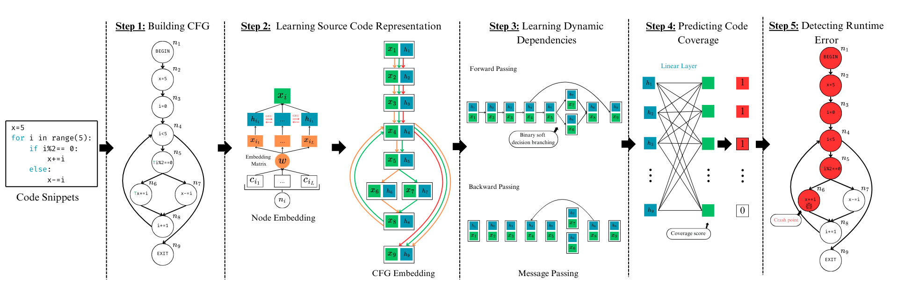

<div align="center">

# CodeFlow: Predicting Program Behavior with Dynamic Dependencies Learning
[](https://arxiv.org/abs/2305.06156)

</div>

## Introduction

We introduce **CodeFlow**, a novel machine learning-based approach designed to predict program behavior by learning both static and dynamic dependencies within the code. CodeFlow constructs control flow graphs (CFGs) to represent all possible execution paths and uses these graphs to predict code coverage and detect runtime errors. Our empirical evaluation demonstrates that CodeFlow significantly improves code coverage prediction accuracy and effectively localizes runtime errors, outperforming state-of-the-art models.

### Paper: [CodeFlow: Predicting Program Behavior with Dynamic Dependencies Learning]()

## Installation

To set up the environment and install the necessary libraries, run the following command:

```sh
./setup.sh
```

## Architecture


CodeFlow consists of several key components:
1. **CFG Building**: Constructs CFGs from the source code.
2. **Source Code Representation Learning**: Learns vector representations of CFG nodes.
3. **Dynamic Dependencies Learning**: Captures dynamic dependencies among statements using execution traces.
4. **Code Coverage Prediction**: Classifies nodes for code coverage using learned embeddings.
5. **Runtime Error Detection and Localization**: Detects and localizes runtime errors by analyzing code coverage continuity within CFGs.

## Usage

### Running CodeFlow Model

To run the CodeFlow model, use the following command:

```sh
python main.py --data <dataset> [--runtime_detection] [--bug_localization]
```

### Configuration Options

- `--data`: Specify the dataset to be used for training. Options:
  - `CodeNet`: Train with only non-buggy Python code from the CodeNet dataset.
  - `FixEval_complete`: Train with both non-buggy and buggy code from the FixEval and CodeNet dataset.
  - `FixEval_incomplete`: Train with the incomplete version of the FixEval_complete dataset.

- `--runtime_detection`: Validate the Runtime Error Detection.

- `--bug_localization`: Validate the Bug Localization in buggy code.

### Example Usage

1. **Training with the CodeNet dataset(RQ1):**
    ```sh
    python main.py --data CodeNet
    ```

2. **Training with the complete FixEval dataset and validating Runtime Error Detection(RQ2):**
    ```sh
    python main.py --data FixEval_complete --runtime_detection
    ```

3. **Training with the complete and incomplete FixEval dataset and validating Bug Localization(RQ3):**
    ```sh
    python main.py --data FixEval_complete --bug_localization
    python main.py --data FixEval_incomplete --bug_localization
    ```
### Generating Your Own Dataset

To generate your own dataset, including CFG, forward and backward edges, and the true execution trace as ground truth for your Python code, follow these steps:

1. **Navigate to the `Generate_CFG_dataset` folder**:
    ```sh
    cd Generate_CFG_dataset
    ```

2. **Place your Python code files in the `dataset` folder**.

3. **Run the dataset generation script**:
    ```sh
    python generate_dataset.py
    ```
To build and visualize CFG for a Python file, use this command:
    ```sh
    python cfg.py \directory_to_Python_file
    ```
